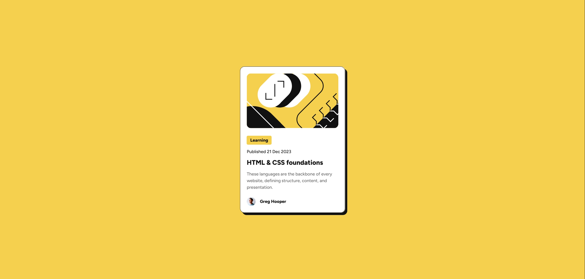

# Frontend Mentor - Blog preview card solution

This is a solution to the [Blog preview card challenge on Frontend Mentor](https://www.frontendmentor.io/challenges/blog-preview-card-ckPaj01IcS). Frontend Mentor challenges help you improve your coding skills by building realistic projects. 

## Table of contents

- [Overview](#overview)
  - [The challenge](#the-challenge)
  - [Screenshot](#screenshot)
  - [Links](#links)
- [My process](#my-process)
  - [Built with](#built-with)
  - [What I learned](#what-i-learned)
  - [Continued development](#continued-development)
  - [Useful resources](#useful-resources)
- [Author](#author)

## Overview

### The challenge

Users should be able to:

- See hover and focus states for all interactive elements on the page
- (Bonus) The font sizes in this project are slightly smaller in the mobile layout. Find a way to reduce font size for smaller screens without using media queries.

### Screenshot



### Links

- Solution URL: [https://github.com/vendkoma/blog-preview-card](https://github.com/vendkoma/blog-preview-card)
- Live Site URL: [https://vendkoma.github.io/blog-preview-card/](https://vendkoma.github.io/blog-preview-card/)

## My process

### Built with

- Semantic HTML5 markup
- CSS custom properties
- Flexbox
- Mobile-first workflow

### What I learned

To complete the extra challenge for the project (reducing font size on smaller screens without using media queries), I learned how to use the CSS **clamp() function**. It took a lot of fine tuning to find the exact range of values that kept the text looking right at various screen sizes, but I'm pleased with the results. The scaling of the paragraph text is more noticeable, while the scaling for the header is more subtle:

```css
p {
    font-size: clamp(0.8rem, 2vw, 16px);
}

h1 {
    font-size: clamp(20px, 2.5vw, 1.5rem);
}
```

In trying to get the illustration image to look exactly like the mobile preview at smaller screen sizes, I also learned a trick to center and crop an image within its container with hidden overflow, relative positioning, and the translate function. I think this should also be possible using other methods like flexbox, but practicing this technique was insightful:

```css
.imgcontainer {
    text-align: center;
    overflow: hidden;
}

.illustration {
    position: relative;
    left: 50%;
    transform: translate(-50%,0);
}
```

### Continued development

The biggest takeaway from this project for me was the power of CSS functions, like clamp() and translate(). In the future I'd like to further explore what can be done with these and other functions.

### Useful resources

- [MDN docs - CSS clamp()](https://developer.mozilla.org/en-US/docs/Web/CSS/clamp) - Detailed explanation and demonstration of the usage of the CSS clamp() function.
- [W3Schools code snippet](https://www.w3schools.com/css/tryit.asp?filename=trycss_align_transform) - Example code to center an element within its container using translate().

## Author

- GitHub - [@vendkoma](https://github.com/vendkoma)
- Frontend Mentor - [@vendkoma](https://www.frontendmentor.io/profile/vendkoma)
